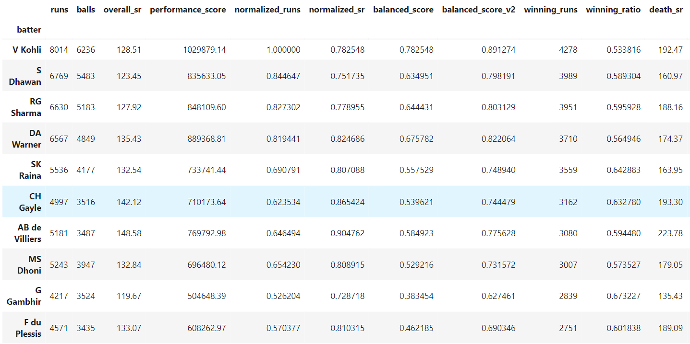

# IPL Data Analysis (Python)

## 📌 Overview

This project performs end-to-end data analysis on IPL cricket data using Python (Pandas, NumPy).

The goal is to move beyond basic statistics and identify:

* Consistent performers
* High-impact players in winning matches
* Aggressive batsmen (strike rate)
* Pressure performers (death overs)
* Most complete batsmen using combined metrics




## 📊 Dataset

* Matches dataset (match-level information)
* Deliveries dataset (ball-by-ball data)

---

## 🧹 Data Cleaning

* Converted date fields to datetime
* Handled missing values carefully:

  * Filled true nulls (winner, player_of_match)
  * Preserved logical nulls (target_runs, method)
* Identified column dependencies in deliveries:

  * dismissal ↔ wicket
  * extras ↔ extra_runs

---

## 🔗 Data Merging

Merged ball-by-ball data with match-level data:

```python
df = deliveries.merge(matches, left_on='match_id', right_on='id')
```

Each row represents **one ball + match context**

---

## 📈 Key Analyses

### 1. Top Batsmen (Total Runs)

Identified consistent high-volume scorers:

* Virat Kohli
* Shikhar Dhawan
* Rohit Sharma

---

### 2. Strike Rate Analysis

Filtered players with >1000 balls to remove noise.

Top aggressive players:

* Andre Russell
* Nicholas Pooran
* Glenn Maxwell

---

### 3. Winning Impact

Calculated:

```python
winning_ratio = winning_runs / total_runs
```

Insight:

* Some players perform better in winning matches
* Metric influenced by team strength

---

### 4. Balanced Performance Metric

Combined:

* Runs (consistency)
* Strike rate (efficiency)

```python
balanced_score = (normalized_runs + normalized_sr) / 2
```

---

### 5. Death Overs Analysis

Filtered overs 16–20 to analyze pressure situations.

Top performers:

* AB de Villiers
* Rishabh Pant
* Chris Gayle

---

### 6. Final Impact Model

Combined:

* Winning contribution
* Career consistency
* Death over performance

```python
impact_score = 0.5 * winning_ratio + 0.5 * normalized_runs
```

---

## 🧠 Key Insights

* No single metric defines the "best" player
* Volume-based players ≠ aggressive players
* Team context affects performance metrics
* Balanced metrics reveal truly consistent performers

Top “complete” players:

* Virat Kohli
* Shikhar Dhawan
* Rohit Sharma

---

## 🛠️ Tech Stack

* Python
* Pandas
* NumPy
* Jupyter Notebook

---

## 🚀 Future Work

* Bowling analysis
* Match prediction
* Visualization dashboards

---

## 📌 Author

Shivam M
